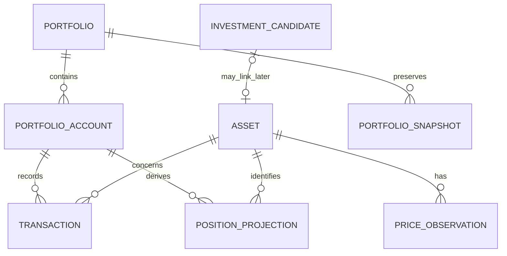

# Wealth Domain Model

## Modeling approach

The wealth feature uses a transaction-ledger model:

1. The user records financial events.
2. The application orders and validates those events.
3. Position and cash calculations derive current state.
4. Dated prices value positions.
5. Snapshots preserve selected point-in-time results.

This differs from maintaining a mutable holdings table as an independent truth. A holdings screen is a projection of the ledger and prices.

## Bounded contexts

### Wealth

Owns accounts, owned assets, transactions, calculated positions, prices, valuations, snapshots, and portfolio analytics.

### Investment watchlist

Owns candidates, thesis, conviction, research state, target prices, and pre-buy decisions. A future optional link may associate a candidate with a wealth asset.

### Expenses

Remains separate. A portfolio contribution or broker fee is not automatically a household expense. Cross-feature reporting can be designed later with explicit semantics.

## Core concepts

### Portfolio

A reporting boundary containing one or more portfolio accounts. Version 1 may use one implicit personal portfolio while preserving a model that can later support more than one.

Examples of future reasons for multiple portfolios include ownership, purpose, or reporting currency. Broker accounts alone do not require separate portfolios.

### Portfolio account

A place in which cash or securities are held, such as a broker account.

Candidate fields:

- `id`
- `portfolioId`
- `name`
- `institutionName`
- `baseCurrency`
- `isActive`
- timestamps

An account does not own the definition of an asset; the same asset may be held in several accounts.

### Asset

A stable identity for an investable or cash-like instrument.

Candidate fields:

- `id`
- `name`
- `isin` when available
- `ticker` when useful
- `assetType`
- `tradingCurrency`
- `isActive`
- timestamps

Identity preference:

1. ISIN for instruments that have one.
2. A provider-aware symbol or another stable identifier when no ISIN exists.
3. An application ID always remains the database primary key.

Ticker alone is not globally unique and may change.

### Classification

The workbook contains two useful classification dimensions that should remain distinct:

- **Bucket:** strategic portfolio role, initially `Core`, `Satellite`, or `Cash`.
- **Category:** instrument or risk grouping, such as `ETF`, `Stock`, `Sector Bet`, `Small Cap`, `Speculative`, `Cash`, `Bond`, or `Other`.

The workbook uses the term `Core`; the UI may later display `Base` if that language is more natural, while retaining one canonical stored value.

Open design point: classifications may belong to the asset globally, to a holding within an account, or to a dated classification history. Version 1 should choose the simplest option that still handles an asset changing strategic role without corrupting history.

### Transaction

An immutable-in-meaning record of a financial event. Corrections may be implemented initially as edit/delete operations with audit timestamps; a stronger long-term design can use reversal and replacement events.

Candidate common fields:

- `id`
- `accountId`
- `assetId` when applicable
- `type`
- `tradeDate`
- optional settlement date later
- `quantity`
- `unitPrice`
- `grossAmount`
- `fees`
- `taxes`
- `currency`
- `fxRateToBase`
- `note`
- source/import provenance
- timestamps

Initial transaction vocabulary:

- `CONTRIBUTION`
- `WITHDRAWAL`
- `BUY`
- `SELL`
- `DIVIDEND`
- `INTEREST`
- `FEE`
- `TAX`
- `TRANSFER`
- `OTHER`

Not every type needs every field. Type-specific validation is part of the domain, not merely form behavior.

### Position

A calculated state for an account and asset at a selected time.

Candidate outputs:

- quantity
- remaining cost basis
- average acquisition cost
- realized profit/loss
- fees and taxes included or reported separately according to the chosen calculation policy
- latest applicable price
- market value
- unrealized profit/loss
- valuation currency and timestamp
- warnings

Positions are not initially stored as authoritative rows. They are derived from transactions and prices and may later be cached as rebuildable projections if performance requires it.

### Cash balance

Cash needs an explicit model because trades and external cash flows affect it.

Two possible representations remain under review:

1. **Calculated account cash:** derive cash from contributions, withdrawals, trades, income, fees, and taxes.
2. **Cash asset:** represent each currency as an asset and use the same position machinery.

The first is simpler for a EUR-only increment. The second generalizes better to multiple currencies and transfers. We should settle this during Milestone 0B before creating the schema.

### Price observation

A price for one asset at an effective date/time.

Candidate fields:

- `id`
- `assetId`
- `observedAt`
- `price`
- `currency`
- `sourceType` such as manual, import, or future provider
- optional source reference
- timestamps

Prices are observations, not overwrites. The latest applicable observation values the current position; historical calculations use the latest valid price at or before the requested point in time according to an explicit staleness policy.

### Portfolio snapshot

A stored point-in-time portfolio result used for history and reconciliation.

Candidate fields:

- `id`
- `portfolioId`
- `snapshotDate`
- total market value
- net external cash flow since the prior snapshot
- optional period return
- valuation/base currency
- creation method and provenance
- note
- timestamps

A snapshot remains unchanged when current prices change. Whether correcting an old transaction should invalidate or merely flag affected snapshots is an open Milestone 0B/0C decision.

### Decision journal entry

The workbook journal contains useful investing context: action, thesis, risks, review triggers, and lessons. The existing watchlist already owns much of the pre-buy thesis domain.

Proposed direction:

- Keep research thesis and candidate status in `investments`.
- Later add wealth activity notes or review events linked to an asset and optionally a transaction.
- Do not duplicate the entire workbook journal in the first wealth persistence milestone.

## Workbook-to-domain mapping

| Workbook concept | App destination | Treatment |
| --- | --- | --- |
| `Transactions` | Wealth transactions | Primary migration input and historical source of truth |
| `Holdings` | Position projection plus asset metadata | Split inputs from calculated outputs; do not import calculated holdings as a second truth |
| `Performance` | Analytics service/view | Recalculate from transactions, positions, prices, and snapshots |
| `Allocation` | Classification targets and analytics view | Preserve bucket/category concepts; targets can follow after basic overview |
| `Snapshots` | Portfolio snapshots | Store dated point-in-time records with provenance |
| `Journal` | Watchlist thesis and future asset review/activity records | Map deliberately; avoid duplicate ownership |
| `Lists` | Domain enums or configurable reference data | Start with typed canonical values; make configurable only when justified |
| `README` | Product help and calculation documentation | Translate relevant conventions into in-app help and project documentation |

## Relationships

`POSITION_PROJECTION` is shown to clarify the domain relationship; it is initially calculated, not an authoritative database table.

## Invariants to enforce

- Monetary and quantity precision policy is explicit; calculations do not rely on accidental binary floating-point behavior.
- A transaction belongs to exactly one account.
- An asset-referencing transaction points to a valid asset.
- Required fields depend on transaction type.
- Transactions are processed deterministically by effective date and a stable tie-breaker.
- A sell cannot silently create a negative position unless short selling is explicitly supported later.
- Current market value always identifies its price date and currency context.
- Closed positions remain available in lifetime history.
- Imported data retains provenance without exposing sensitive content to logs.
- Derived totals must reconcile or emit an actionable warning.

## Decisions needed before Milestone 1

1. Is version 1 one implicit portfolio, or should the portfolio table exist immediately?
2. Should cash be derived account state or modeled as currency assets?
3. Which cost-basis method should monitoring use?
4. How do fees and taxes affect cost basis and realized return?
5. Should classifications be current asset attributes or dated/account-specific assignments?
6. What precision/storage strategy should be used for money, prices, quantities, and FX rates?
7. Which transaction types enter the first UI increment?
8. Are edits/deletes acceptable initially, and what audit metadata must be retained?

